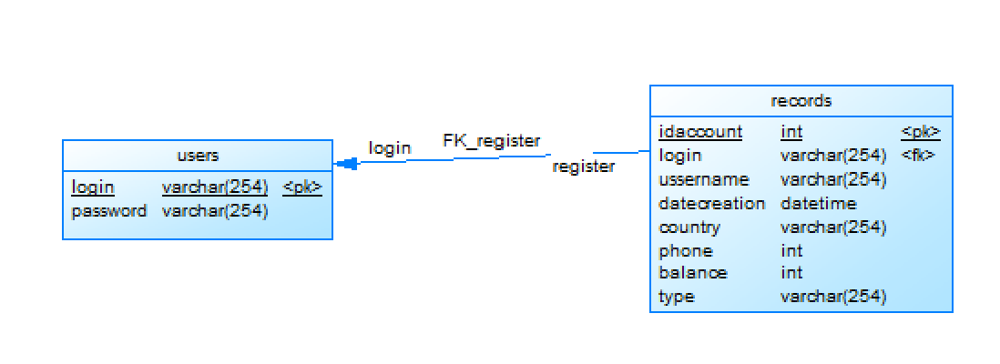
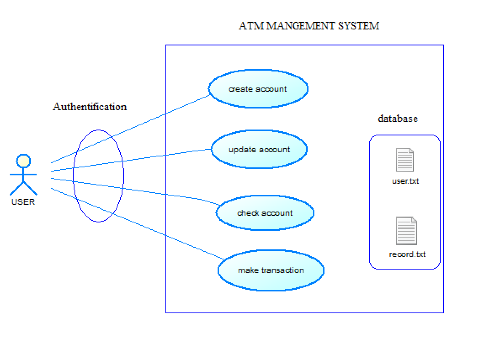

  privided by Serigne fallou (sedia) 
mail:dia.serignfalou@gmailcom

 
 ATM MANAGEMENT SYSTEM

ATM management is a system where users can do the following actions:

1. Login/Register  
2. Create a new account
3. Check the details of existing accounts
4. Update information of existing accounts
5. Remove existing accounts
6. Check list of owned accounts
7. Make transactions

The application will handle all this future and use for saving two options.

the first one is all informatoions is saved on a file (users.txt or records.txt).

and the last one is from a database. it's shema is like:

Diagramme d'etude de cas:

### to use my application you have to:

### RUN This command: git clone [link](https://learn.zone01dakar.sn/git/sedia/atm-management-system.git)
### RUN cd atm-managelent-system
### RUN make on the terminal (this will create an executable file)

### RUN ./atm
